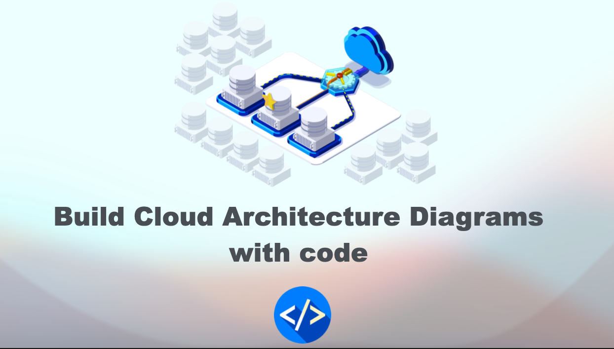
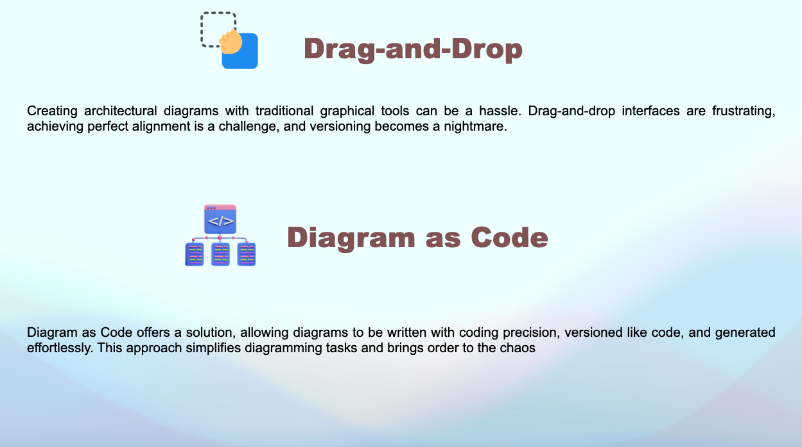
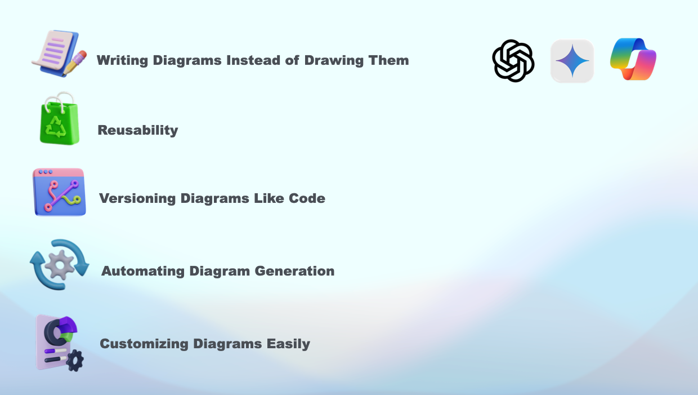
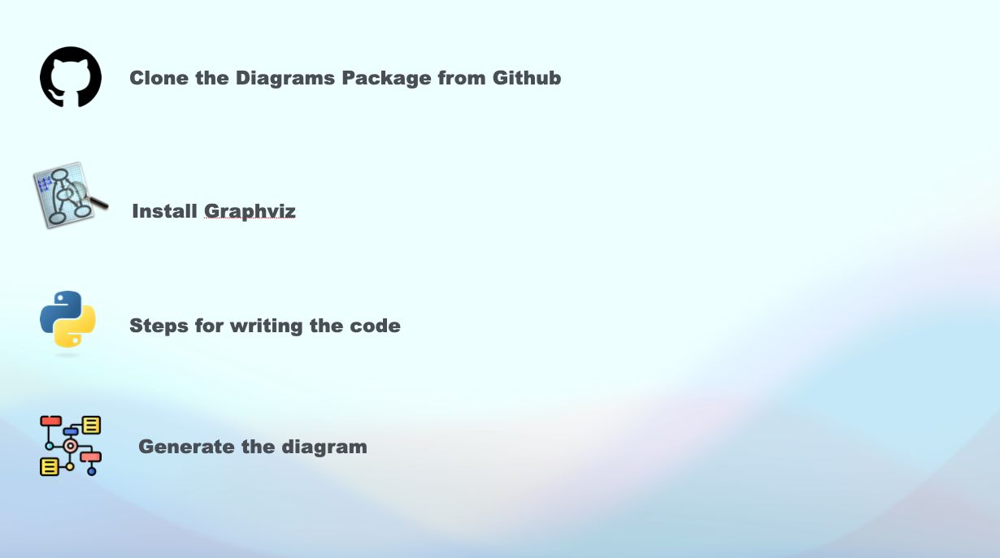

# 🚀 Diagram as Code Demonstration
[](https://www.linkedin.com/in/amine-maalej/)

[](https://www.youtube.com/@CloudTech_with_Amine)





## 🌟 Overview
In this video, we’re diving into a powerful technique to streamline cloud architecture diagramming: Diagram-as-Code. If you’ve ever struggled with traditional drag-and-drop tools, you know how tedious alignment, edits, and versioning can be. Diagram-as-Code changes the game by letting you create detailed, version-controlled architecture diagrams with just code.

I’ll walk you through the essentials of Diagram-as-Code, demonstrating how to set up and generate cloud architecture diagrams in a precise and repeatable way. 
- **Benefits of Diagram-as-Code for cloud architecture**
- **How to create, edit, and version diagrams with code**


## 📝 Comprehensive Guide
For a detailed guide, please refer to the [Youtube video](https://www.youtube.com/watch?v=r5Seo2IGTw0).

## ✅ Slides

Slide 1            | Slide 2         | Slide 3       
:------------------------:|:-----------------------:|:----------------------:|
  |  |  

## 💻 Steps for writing the code Manually

### “Diagram” — Top level container of your diagram

```
with Diagram("S3 to RDS", show=True, direction="LR", curvestyle="ortho", outformat="png"):
```

S3 to RDS refers to the filename of the image to save

direction — It will start building the containers from Left to right(LR), Right to Left, Top to Bottom are options you can use if needed.

output format- currently supports "png", "jpg", "svg", "pdf" formats.


### “Cluster” — Second level container (you can specify the name or label of the container)

```
with Cluster("AWS"):
```

### Edge

“>>” — Right pointed arrow or edge

```
event_bridge >> Edge(label="triggers") >> lambda1
```

“<<”— Left pointed arrow or edge

“-” — Edge without direction or bidirectional

```
s3_raw_layer - Edge(label="push") - lambda1
```

## 🔗 Links

### Official Diagram GitHub Package

```
https://github.com/mingrammer/diagrams?tab=readme-ov-file 
```

Happy learning 📚